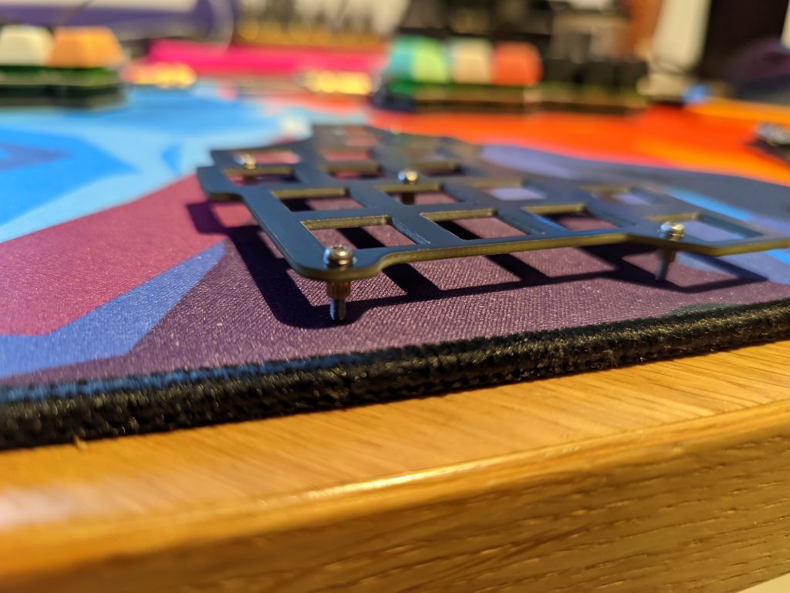
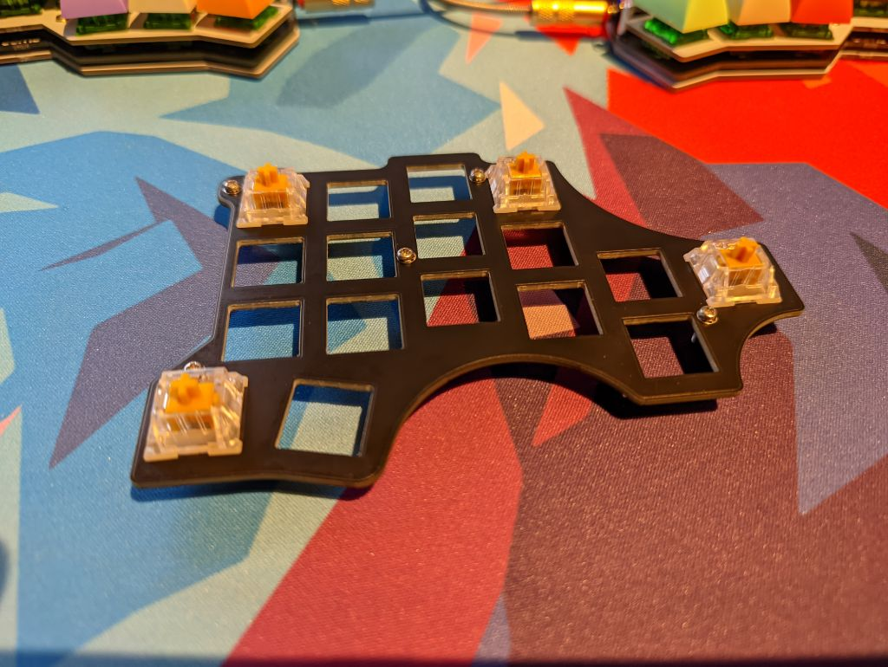
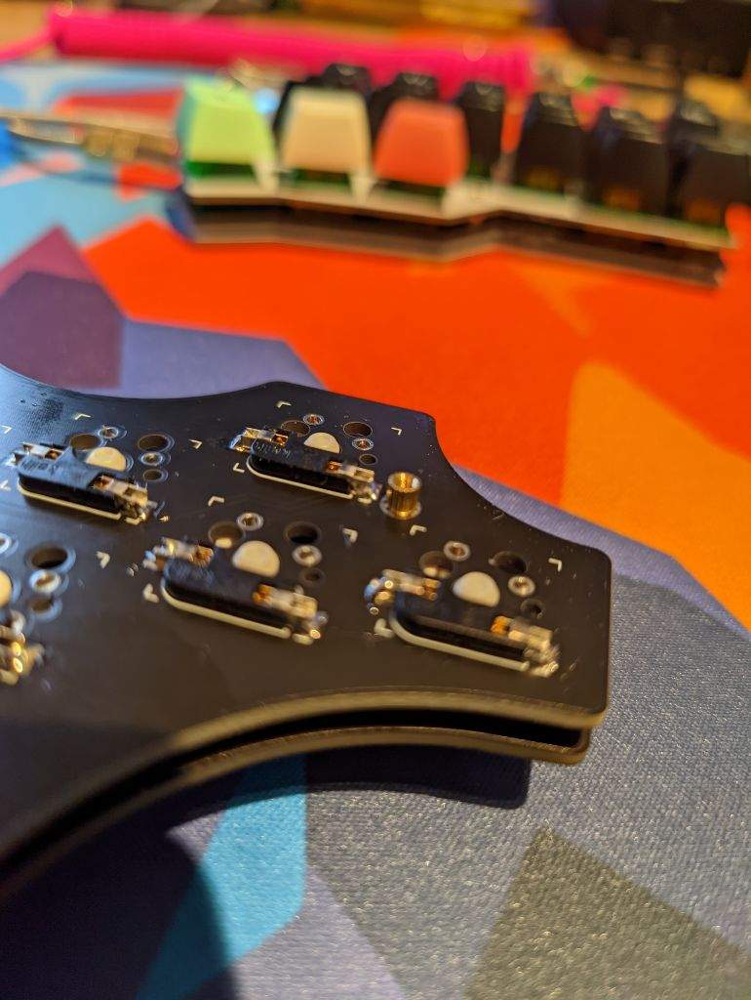

# Build Guide

This is the build guide for [the Sephirette](https://www.smoresboards.com/product/sephirette).

## Parts

### Required

| Name | Count | Remarks |
|:-|:-|:-|
| PCB's | 2 | |
| Pro Micros | 2 | |
| 12-Pin Sockets | 4 | |
| Reset Switches | 2 | |
| Key Switches | 34 | |
| Keycaps | 34 | |

#### Wired Build

| Name | Count | Remarks |
|:-|:-|:-|
| TRRS Jacks | 2 | |
| TRRS (4 poles) Cable | 1 | |
| Micro USB/USB-C Cable | 1 | According to the selected Pro Micro-compatible MCU |

#### Wireless Build

| Name | Count | Remarks |
|:-|:-|:-|
| Power Switches | 2 | |
| Batteries | 2 | |

### Optional

| Name | Count | Remarks |
|:-|:-|:-|
| Hot-Swap Sockets | 34 | |
| Top Plates | 2 | |
| Bottom Plates | 2 | |
| M2 Standoffs (3mm) | 20 | |
| M2 Bolts (8mm) | 10 | |
| M2 Bolts (3mm) | 10 | |
| M2 Washers | 10 | |
| Bumpons | 8-10 | |

## Assembly

If you are going to use hot-swap sockets, solder them on the **bottom** side of each half first.

Solder the reset switches and TRRS jacks on the **top** of the PCB's.

Solder the Pro Micros using the 12-pin sockets on the **top** side of the PCB's.

**NOTE:** Make sure to properly align your Pro Micro MCU pins with the text on the PCB's. The left half has the Pro Micro face-down and the right half has it face-up.

If you are going to use switch plates, now you should screw the 8mm screws into the switch plates from the **top**, held in place by 5 of the 3mm standoffs per half under the switch plates. 

Insert 4 switches in the corners and don't forget to properly align them with the hot-swap sockets (if you are using them).

Place the washers onto the PCB's over top the mounting holes.

Align the 8mm screws (poking out of the bottoms of the switch plates) with the washers on the PCB's and gently press the 4 switches into place. After that, you can add the remaining switches.

On the backsides of the PCB's, screw in the remaining 3mm standoffs.

With the boards upside-down, put the bottom plates on the standoffs and screw in the 3mm screws. Then add the bumpons.

Add some keycaps and you're good to go!

## Firmware

You can use the [QMK config](https://github.com/smores56/qmk_firmware/tree/master/keyboards/clog) of the clog or ZMK config in the main repo of [ZMK](https://zmk.dev/). (This board uses the Clog firmware and will be named as such on your computer.)

If you want to use the default keymap, you can just grab [this firmware](assets/clog_default.hex) and flash it right away.
